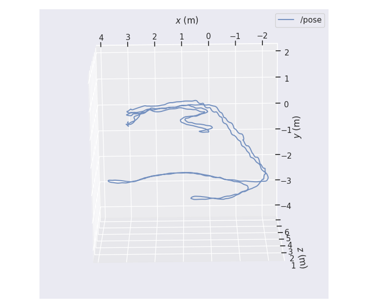
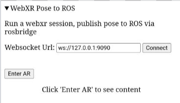

# webxr_ros_pub

Quick experiment using rosbridge to publish webxr device pose to ROS.

Have taken webxr example [ar-barebones.html](https://github.com/immersive-web/webxr-samples/blob/main/ar-barebones.html), and added a rosbridge publisher based on [roslibjs tutorials](http://wiki.ros.org/roslibjs/Tutorials/BasicRosFunctionality)



**Figure**: Trajectory from running the webxr publisher, quickly walking around my home, logging `/pose` then plotting with [`evo`](https://github.com/MichaelGrupp/evo). Trajectory covered two rooms upstairs, staircase descent, walking through two rooms downstairs, then returning to the starting pose upstairs. Trajectory looks decent, no significant drift observed from start to end pose.


## Usage:

NOTE - Webxr is only available in [secure contexts](https://developer.mozilla.org/en-US/docs/Web/Security/Secure_Contexts), and further, [insecure websockets cannot be opened from a page served over https](https://stackoverflow.com/a/50865515/5718370). Hence there are two options for accessing wbexr and publishing to rosbridge:
* serve page over https, use a secure websocket for rosbridge (requires self-signed ssl certs)
* serve page from phone localhost, use insecure websocket for rosbridge (requires webserver on phone)

Instructions are provided for both options; I found the self-signed cert option easiest.

### Option one: self-signed cert (recommended)

1) Setup the linux/ROS machine
    1) prepare certs on your linux/ROS machine
        ```
        openssl genrsa -out server_key.pem 2048
        openssl req -new -key server_key.pem -out server_csr.pem -batch
        openssl x509 -req -days 1825 -in server_csr.pem -signkey server_key.pem -out server_cert.pem
        ```
    1) Install and run rosbridge server
        ```
        sudo apt install ros-humble-rosbridge-server
        . /opt/ros/humble/setup.bash
        ros2 run rosbridge_server rosbridge_websocket --ros-args -p ssl:=true -p certfile:=server_cert.pem -p keyfile:=server_key.pem -p server_key.pem:=false
        ```
1) Phone setup
    
    1) Mark the new certificate as "trusted"
        1) In the phone's browser, navigate to `https://<ip of the linux laptop>:9090`
        1) You should see a "Your connection is not private" dialog (this was tested in Chrome). Click "Advanced", then "Proceed to <ip> (unsafe)". You should see a message "can upgrade only to websocket" - this can be ignored.
    1) In the phone's browser, navigate to: https://tim-fan.github.io/webxr_ros_pub/webxr_ros_pub.html

        The page should look like the following:

        
    1) Set the websocket url to `wss://<ip of the linux laptop>:9090`, then click connect. You should see a popup confirming a successful connection.
    1) Click "Enter AR" to start the webxr session.

1) Confirm it's working

    You should now see the device pose displayed on the phone screen, and the pose should also be publishing to ROS via the bridge server.
    
    On the linux/ROS machine, confirm pose is being received with:

    ```
    ros2 topic echo /pose
    ```

    You can now open RViz, set fixed frame to "world", and subscribe to `/pose` to view the device pose in realtime.

### Option 2: webserver on phone

This was the first way I managed to get it running, but was more of a hassle.

1) Setup the linux/ROS machine (same as above, but no certificates required)
    1) Install and run rosbridge server
        ```
        sudo apt install ros-humble-rosbridge-server
        . /opt/ros/humble/setup.bash
        ros2 run rosbridge_server rosbridge_websocket 
        ```
1) Phone setup
    
    1) Install [Simple HTTP Server](https://play.google.com/store/apps/details?id=com.phlox.simpleserver)
    1) Set it up to serve directory `Downloads/webxr_ros` on port 8080, start the server
    1) from this repo, download `webxr_ros_pub.html` into that directory
    1) in the phone browser, navigate to `localhost:8080/webxr_ros_pub.html`
    The page should look like the following:
    
    1) Set the websocket url to `ws://<ip of the linux laptop>:9090`, then click connect. You should see a popup confirming a successful connection.
    1) Click "Enter AR" to start the webxr session.
1) Confirm its working: same as above (option 1) 


## debugging

On laptop, go to
chrome://inspect/#devices

enable usb debugging on the phone, connect phone to laptop

open page on phone, then inspect from laptop

## Misc Notes

Linear and angular vel apparently not available in the pose:
https://github.com/immersive-web/webxr/issues/185

Distribution:
* Ideally the html page could be hosted, say, on github pages, and the user could browse to that page, and enter the settings to connect to their rosbridge server. BUT:
* webxr wants secure origin, which means either serving the html on localhost on the phone (requires webserver), or serving externally via https, which then requires the websocket to use ssl as well (mixed content issue). So user either needs to setup a webserver on the phone, or setup certs for the websocket. I'm still wondering if packaging into a native app is an option, but it sounds like android webviews do not support webxr right now, at this point it probably makes sense to drop webxr and use unity or native ARCore api.

Latency: haven't measured, but from visual RViz inspection I'd guess in the 0.1s to 0.2s range. Would be good to measure somehow. I'd say this latency might be acceptable for general localisation applications, but may be problematic if the intent is to use this output for odometry.

Got pose out, 30Hz
 - check if faster rate possible?
 - look into transform from webxr frame to REP compliant? (e.g. z up) Just publish static tf to webxr frame

Attempting hosting on github pages, but now getting errors RE insecure websockets on pages loaded via https
```
roslib.js:3466 Mixed Content: The page at 'https://tim-fan.github.io/webxr_ros_pub/webxr_ros_pub.html' was loaded over HTTPS, but attempted to connect to the insecure WebSocket endpoint 'ws://192.168.1.250:9090/'. This request has been blocked; this endpoint must be available over WSS.
Ros.connect @ roslib.js:3466
webxr_ros_pub.html:1 Uncaught DOMException: Failed to construct 'WebSocket': An insecure WebSocket connection may not be initiated from a page loaded over HTTPS.
    at Ros.connect (https://cdn.jsdelivr.net/npm/roslib@1/build/roslib.js:3466:18)
    at new Ros (https://cdn.jsdelivr.net/npm/roslib@1/build/roslib.js:3444:10)
    at https://tim-fan.github.io/webxr_ros_pub/webxr_ros_pub.html:63:15
```

## TODO: 
* ROS-side nodes for better interfacing
    * frame transformations?
    * produce odom messages?
    * provide map->odom tf?
* Rotate published pose orientation 
* try different reference space (unbounded? will need to request feature in requestSession)
* look into depth api
* consider calc velocity via differentiation? Better try access IMU? 
* log some trajectories and inspect
 * can use for teach and repeat? 
    * Does trajectory drift over time? Does this change with different reference spaces? Can anchors be used to mitigate drift?
* look into publishing anchors
* best way to distribute?
 * could host on webserver, but webxr requires https, so rosbridge will require secure websocket, so users will have to setup/install certs to use? 
 * alternative - try bundle html into app, perhaps webxr will be happy and websockets can still be insecure
