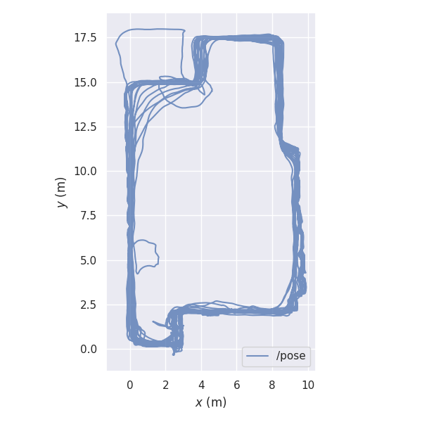

# Notes: testing pose output from quest 2 via webxr

## Questions
* in a limited area, is there pose drift over time?
* persistence:
    * If I start a new session after power cycle, does the device localise within the same map/coordinate frame? 
    * In which situations will the 

## Tests

* drift
    * walk repeated loops in a given area - does pose drift?
* max map size
    * walk increasingly large loops, returning to start point. At what loop size does device fail to recognise return to start?
* Persistence
    * wipe map history, walk around an area, record trajectory. Stand in particular test location and note pose
    * reboot, walk around the area again - has coordinate frame drifted? Is same pose reported in the test location
    * repeat above multiple times - does the coordinate system eventually change?
    * take to totally different space, map it, use device in that area for some time. Return to original area - does pose jump into original coordinate space? What happens after reboot

## Results

### Drift

**Figure 1:** Drift test, front yard

#### Conditions for above test:
* Location: Front yard, 20 loops
* Path length: 1147m
* Area covered: approx 150 m^2
* Test duration: 20 minutes  
* Headset: Quest 2
* Date: August 2023
* Headset software: whatever was up-to-date at that time
* Webxr interface: [webxr_barebones.html](https://github.com/tim-fan/webxr_ros_pub/blob/24f2dee9e32cdaf98c79a1c4f8e9da36591010ee/webxr_barebones.html)

#### Observations

No drift observed, walking near continuously for 20 minutes. Looks solid!

Based on this, it looks like the headset could serve as a reliable single-session localisation system (I haven't confirmed if it will re-localise to a prior map, but at least it will maintain localisation within the map associated with the current session). Seems like it could be handy for mapping, teach+repeat, return to start etc.